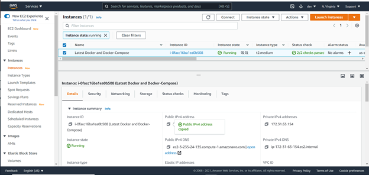
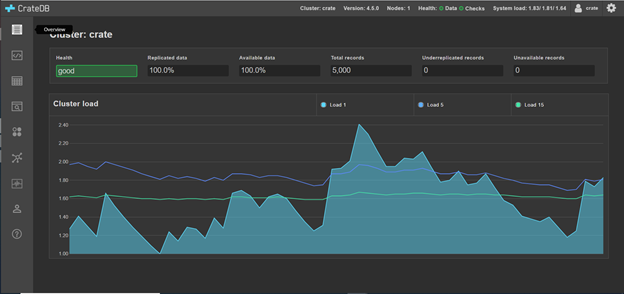
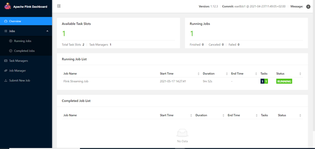
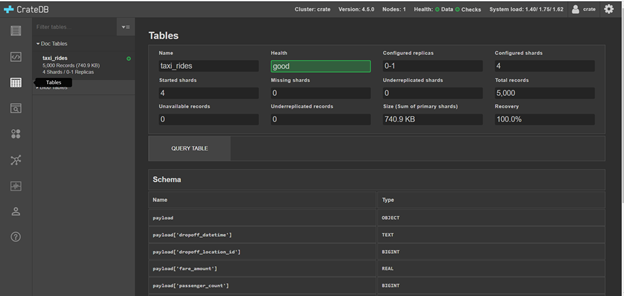
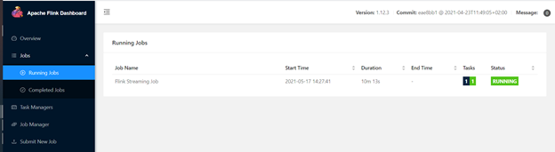
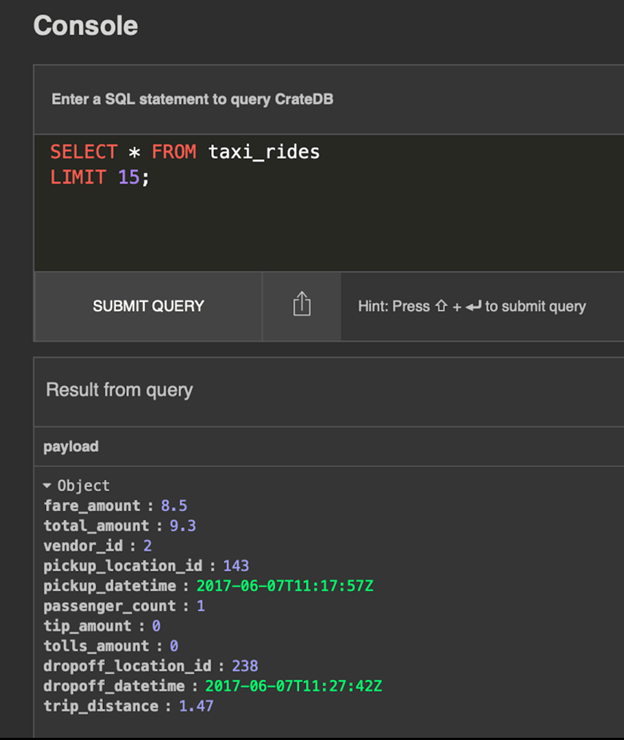
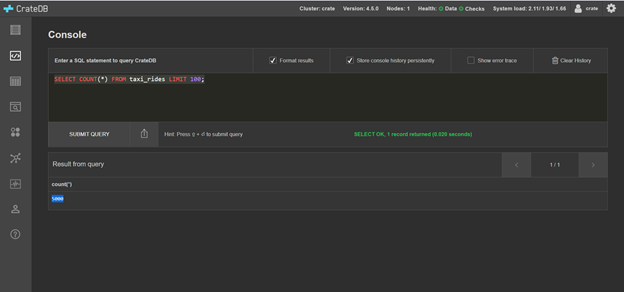

# **Build a data ingestion pipeline using Kafka, Flink, and CrateDB**

This tutorial explains how to build a data ingestion pipeline using three open-source tools: Apache Kafka, Flink, and CrateDB.

[Kafka](https://kafka.apache.org/documentation/) is the front line of the stack, used to queue messages received from (for example) IoT sensors and devices. [CrateDB](https://crate.io/download/) will query and store the data. And between CrateDB and Kafka, it lives [Apache Flink](https://flink.apache.org/), a data processing engine. These three tools are all distributed systems that provide elastic scaling, fault tolerance, high-throughput, and low-latency performance via parallel processing.

_This tutorial uses Kafka 6.1.1, Apache Flink 1.12, and CrateDB 4.5.0 in a macOS system._


**Preliminary notes**


1. This guide references the example job published at [https://github.com/crate/cratedb-flink-jobs](https://github.com/crate/cratedb-flink-jobs). This example job brings together three software components: the [Kafka connector for Flink](https://ci.apache.org/projects/flink/flink-docs-stable/dev/connectors/kafka.html), the [JDBC connector for Flink](https://ci.apache.org/projects/flink/flink-docs-stable/dev/connectors/jdbc.html), and the [CrateDB JDBC driver](https://github.com/crate/crate-jdbc). It uses a sample dataset including a subset of trip records completed in NYC taxis during 2017. Explore [the repository](https://github.com/crate/cratedb-flink-jobs) for more insights into it.

2. This guide assumes you have [Docker](https://www.docker.com/), [Git](https://git-scm.com/), [Homebrew](https://brew.sh/), and [Wget](https://www.gnu.org/software/wget/) installed. If you don&#39;t have/don&#39;t want to install these components in your machine, you can always use alternatives, but the steps on this guide will follow more smoothly if you have them installed.

3. CrateDB uses a mmapfs directory by default to store its indices. In a real use case, the default operating system limits on mmap counts are likely to be too low, which may result in out of memory exceptions. If you have to, you can increase the limits by running the command **sudo sysctl -w vm.max\_map\_count=262144**. To set this value permanently, update the vm.max\_map\_count setting in /etc/sysctl.conf. You can verify it after rebooting by running sysctl vm.max\_map\_count.

4. This guide is built so you can run the complete suite of technologies locally. It does not address aspects like high-availability, fault-tolerance, or scalability.

**Starting Kafka, Flink and CrateDB**

The simplest possible way to setup and start all software components at once is to use [Docker](https://www.docker.com/) with [Docker Compose](https://docs.docker.com/compose/). To do so, first set up a sandbox directory and navigate to it with your terminal:

## Set up a directory to host your containers
```
mkdir -p sandbox/kafka-flink-cratedb
```
## Navigate to it
```
cd ./sandbox/kafka-flink-cratedb/
```
Next, start Kafka, Flink and CrateDB through docker-compose:

## Clone the repository cratedb-examples
```
git clone https://github.com/crate/cratedb-examples
```
## Navigate to the kafka-flink directory
```
cd cratedb-examples/spikes/kafka-flink
```
## Start the containers
```
docker-compose up
```
Once everything is ready, you will be able to access both Flink and CrateDB through their graphical user interfaces.

To access the CrateDB UI, open [http://localhost:4200/](http://localhost:4200/) in your browser:



To access the Apache Flink UI, open [http://localhost:8081/](http://localhost:8081/) in your browser:



**Communicating with Kafka through Kafkacat**

To communicate with Kafka, you can use [Kafkacat](https://github.com/edenhill/kafkacat), a command-line tool that allows to produce and consume Kafka messages using a very simple syntax. It also allows you to view the topics&#39; metadata.

You can install Kafkacat through Homebrew. To do so, use:

```
brew install kafkacat
```

For some quick examples of how to use Kafkacat, take a look at the commands below. If you want to dive deeper, [this post summarizes the basic Kafkacat parameters very well](https://dev.to/de_maric/learn-how-to-use-kafkacat-the-most-versatile-kafka-cli-client-1kb4).

## List all the Kafka topics and partitions
```
kafkacat -L -b localhost:9094
```
## Write a message
```
export MESSAGE=&quot;The quick brown fox jumps over the lazy dog&quot;
```
## Publish message to the topic test
```
echo $MESSAGE | kafkacat -b localhost:9094 -P -t test
```
## Consume messages from the topic test
```
kafkacat -b localhost:9094 -C -t test -o end
```
**Get some data**

As we mentioned in the preliminary notes, in this guide we will be using a small subset (with 5000 records) of a public dataset that includes information about NYC taxi trips published by the [NYC Taxi and Limousine commission](https://www1.nyc.gov/site/tlc/about/tlc-trip-record-data.page).

To obtain the sample data, use:

## Acquire the NYC taxi dataset in JSON format
```
wget https://gist.github.com/kovrus/328ba1b041dfbd89e55967291ba6e074/raw/7818724cb64a5d283db7f815737c9e198a22bee4/nyc-yellow-taxi-2017.tar.gz
```
## Extract archive
```
tar -xvf nyc-yellow-taxi-2017.tar.gz
```
## Create a subset of the data (5000 records) for the purpose of this tutorial
```
cat nyc-yellow-taxi-2017.json | head -n 5000 \&gt; nyc-yellow-taxi-2017-subset.json
```
**Create a Kafka topic**

To create the Kafka topic that will eventually ingest the data we just downloaded, run the code below. It creates a topic called &quot;rides&quot;.
```
docker run -it --network=scada-demo confluentinc/cp-kafka:6.1.1 \

kafka-topics --bootstrap-server kafka-broker:9092 --create --replication-factor 1 --partitions 1 --topic rides
```
**Invoking the Flink job**

Before setting up the Flink job, we need to create a table in CrateDB to host the data. We will call it taxi\_rides. Use this command:
```
docker run -it --network=scada-demo westonsteimel/httpie \

http &quot;cratedb:4200/\_sql?pretty&quot; stmt=&#39;CREATE TABLE &quot;taxi\_rides&quot; (&quot;payload&quot; OBJECT(DYNAMIC))&#39;
```
The table will show in the CrateDB UI:



Now, it&#39;s time to invoke the Flink job that subcribes to the topic rides. To do so, follow these steps:

## Acquire Flink job
```
VERSION=0.2

JARFILE=&quot;cratedb-flink-jobs-${VERSION}.jar&quot;

wget https://github.com/crate/cratedb-flink-jobs/releases/download/${VERSION}/${JARFILE}
```
## Invoke Flink job
```
docker run -it --network=scada-demo --volume=$(pwd)/${JARFILE}:/${JARFILE} flink:1.12 \

flink run --jobmanager=flink-jobmanager:8081 /${JARFILE} \

--kafka.servers kafka-broker:9092 \

--kafka.topic rides \

--crate.hosts cratedb:5432 \

--crate.table taxi\_rides
```
The running job will show in the Flink UI:




**Publish data to the Kafka topic**

Now that we have everything set up, you are ready to publish the NYC taxi data into Kafka. Run:

## Subscribe to the topic to receive messages
```
docker run -it --network=scada-demo edenhill/kafkacat:1.6.0 kafkacat -b kafka-broker -C -t rides -o end
```
## Publish data to the Kafka topic
```
cat nyc-yellow-taxi-2017-subset.json | docker run -i --network=scada-demo confluentinc/cp-kafka:6.1.1 \

kafka-console-producer --bootstrap-server kafka-broker:9092 --topic rides
```
You are all set! You can now query the data from the CrateDB UI. Keeping it simple:





Hope this was useful 🤙 See you around!