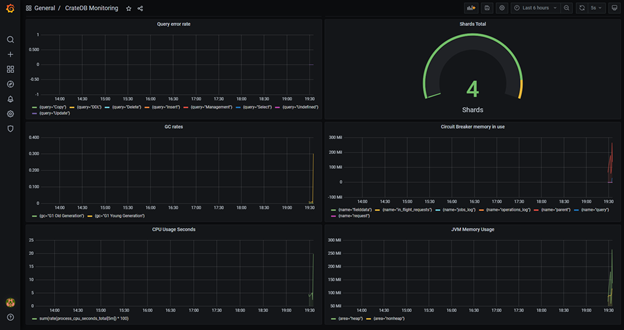
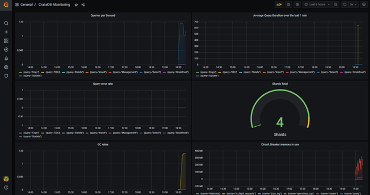

# **Monitoring your database with Prometheus and Grafana**

[Prometheus](https://prometheus.io/) is an open-source systems&#39; monitoring and alerting toolkit. It is very useful for monitoring machine metrics and service-oriented architectures, supporting multi-dimensional data collection and querying. If paired with [Grafana](https://grafana.com/), the open-source visualization tool that we introduced [in this previous post](https://crate.io/a/monitoring-cratedb-on-kubernetes-with-prometheus-and-grafana/), one can build very nice monitoring dashboards.

In this tutorial, we will show you:

- How to set up CrateDB (the [open source database](https://crate.io/) we develop at Crate.io), Prometheus, and Grafana with docker-compose
- Hoe to enable JMX monitoring in CrateDB
- How to set up a monitoring dashboard in Grafana, giving you the option of importing a complete pre-built dashboard

We&#39;re using CrateDB 4.5.0, Prometheus 2.26.0 and Grafana 7.5.2.

Let&#39;s do it!

**Starting Prometheus, Grafana and CrateDB with Docker (+ JMX monitoring)**

To run our tools, we will be using [Docker](https://docs.docker.com/compose/). We will build our containers by using docker-compose, which comes very handy to define and run multi-container Docker applications very quickly.

Docker-compose comes pre-installed with your Docker installation. If you don&#39;t have Docker installed, you can download it [here](https://www.docker.com/products/docker-desktop) — just follow the instructions that will pop-up.

Once your installation of Docker is complete, create a working directory and navigate there with your terminal. There, create a docker-compose.yml file with the following content:
```
version: "3.9"
services:
  cratedb:
    image: "crate"
    volumes:
      - ./crate-jmx-exporter-1.0.0.jar:/jmxdir/crate-jmx-exporter-1.0.0.jar
    ports:
      - "4200:4200"
      - "7071:7071"
    environment:
      CRATE_JAVA_OPTS: "-javaagent:/jmxdir/crate-jmx-exporter-1.0.0.jar=7071 -Dcom.sun.management.jmxremote -Dcom.sun.management.jmxremote.authenticate=false"
  prometheus:
    image: "prom/prometheus"
    volumes:
      - ./prometheus.yml:/etc/prometheus/prometheus.yml
    ports:
      - "9090:9090"
  grafana:
    image: "grafana/grafana"
    ports:
      - "3000:3000"
```
(You can create a [.yml](https://www.reviversoft.com/file-extensions/yml) file through multiple methods. In macOS, you can open a terminal text editor like nano, saving the file with the .yml extension. You can also use a [text editor](https://support.apple.com/guide/textedit/welcome/mac).)

Now, let&#39;s move on to the next step. As we briefly mentioned in the introduction, to scrape CrateDB we&#39;re making use of the [Java Management Extensions (JMX)](https://en.wikipedia.org/wiki/Java_Management_Extensions) and the CrateDB [JMX monitoring feature](https://crate.io/docs/crate/reference/en/latest/admin/monitoring.html).

To set it up, download the latest JMX monitoring .jar [here](https://repo1.maven.org/maven2/io/crate/crate-jmx-exporter/). Click on /1.0.0; in this blogpost, I&#39;m using the file called [crate-jmx-exporter-1.0.0.jar](https://repo1.maven.org/maven2/io/crate/crate-jmx-exporter/1.0.0/crate-jmx-exporter-1.0.0.jar). Then, move the .jar file into the working directory you created before.

_Note: let&#39;s take a closer look at what&#39;s happening here. With the help of the  __.yml__  file we defined earlier, we are going to start three containers at the same time (CrateDB, Prometheus, and Grafana) and expose their relevant ports. Besides, we are including the  __JMXExporter.jar__  into the Docker container, by using the  __volumes__  directive. Then, we are using the  __-javaagent__  directive to enable the JMXExporter and configure it to use port 7071. The other arguments you see in the file are needed to fully enable JMX Monitoring._

One last configuration item. Before we can start Prometheus, we need a new configuration file for it. In order to do that, create a new .yml file named **prometheus.yml** in your working folder, and paste the following content in it:

```
global:
  scrape_interval: 15s
  scrape_timeout: 10s
  evaluation_interval: 15s
scrape_configs:
- job_name: prometheus
  honor_timestamps: true
  metrics_path: /metrics
  scheme: http
  static_configs:
  - targets:
    - cratedb:7071
```
Now, we are ready to start all the containers. Navigate to your working folder with the terminal and run the following command:
```
docker-compose up
```
Wait a few seconds for the process to end. When it finishes, you can access CrateDB, Prometheus, and Grafana.

👉To connect to the CrateDB, open [http://localhost:4200/](http://localhost:4200/) in your browser

👉To connect to Prometheus, open [http://localhost:9090/](http://localhost:9090/) in your browser


If you click on &quot;Status -\&gt; Targets&quot;, you will see that CrateDB is already set up as an endpoint:

👉To connect to Grafana, open [http://localhost:3000/](http://localhost:3000/) in your browser

_Note: if this is your first time using Grafana, first fill &quot;admin&quot; in both the username and the password field. You can define your credentials on the next screen._

**Setting up a pre-built monitoring dashboard in Grafana**

Now that we have all our tools ready, let&#39;s set up a dashboard to monitor our cluster in Grafana using Prometheus as the data source.

In Grafana, go to &quot;Configuration -\&gt; Data sources&quot;:


Now, click on &quot;Add data source&quot;:


Select &quot;Prometheus&quot;:


A configuration page will show up. Fill up the following fields:

- Name: Prometheus
- Host URL: [http://prometheus:9090/](http://prometheus:9090/) You can leave all the other fields with the default configuration.


When you&#39;re done, scroll to the end of the page, and click on &quot;Save &amp; Test&quot;. If everything goes well, you&#39;ll see a message saying &quot;Data source is working&quot;.


Now, let&#39;s set up our dashboard. On the left menu, click on &quot;Create -\&gt; Dashboard&quot;:

You will see a screen like the one below. Click on &quot;Add new panel&quot;. (Panels are the building blocks of Grafana&#39;s dashboards).

The configuration screen for your new panel will open up. Here, you can define all the elements of your panel, like its name, queries, type of visualization, and so on.

To learn about all the possibilities that Grafana offers, check out their [documentation](https://grafana.com/docs/grafana/latest/panels/), and experiment by building your own panels.

In this tutorial, however, I am going to give you the option of  **importing a pre-built monitoring dashboard**.



In order to do so, first download [this JSON file](https://gitlab.com/cratedb1/monitoring-grafana/-/snippets/2101894).

Then, on the Grafana home page, click on &quot;Create -\&gt; Import&quot;:

Now, press on &quot;Upload JSON file&quot;, and select the JSON file you just downloaded. Then, click on &quot;Import&quot;.

Voilà! You now have a complete dashboard monitoring CrateDB in real-time 👏 Your panels show:

- Queries per second
- Average query duration over the last minute
- Query error rate
- GC rates
- Number of shards
- Circuit breaker memory in use
- JMV memory in use

_PS: This dashboard is similar to what we&#39;re using at Crate.io for monitoring real clusters in production. This is how it looks like for one of our customers:_





Hope this was useful 😁
