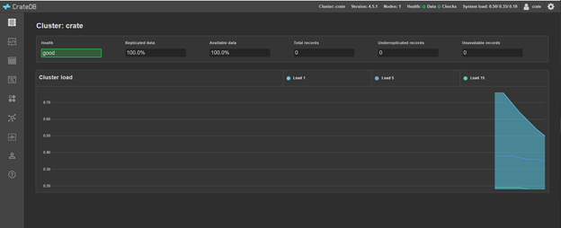
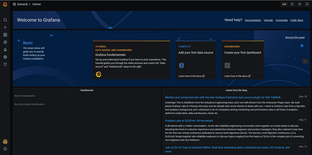
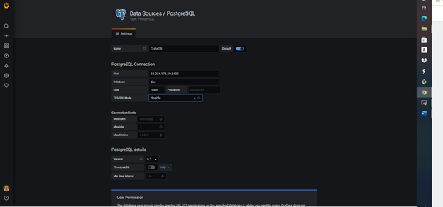
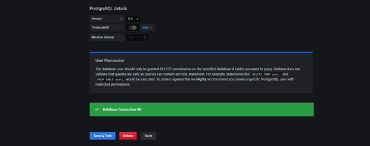
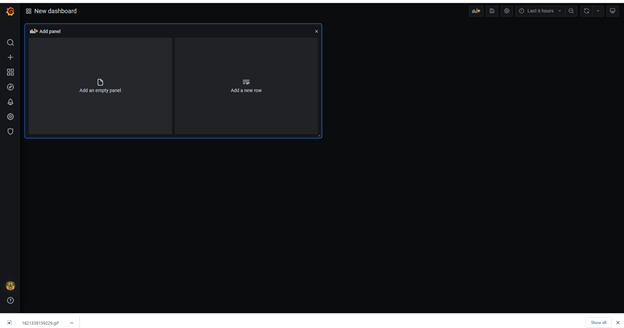
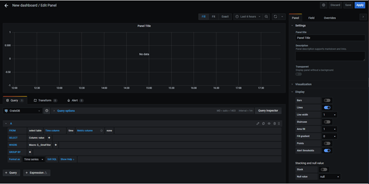
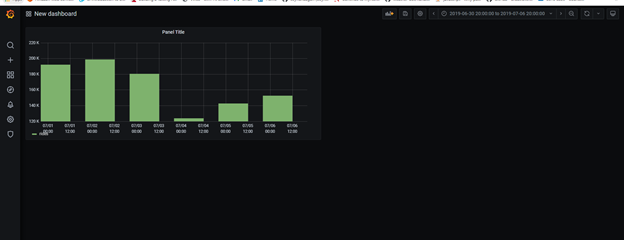
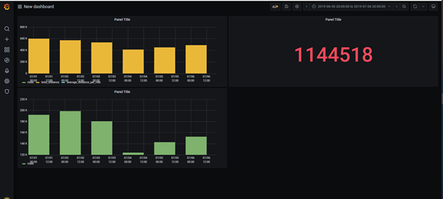

# **Visualizing time series data with Grafana and CrateDB**


[Grafana](https://grafana.com/) is an open-source tool that helps you build real-time dashboards and graphs. It is the perfect complement to [CrateDB](https://crate.io/products/cratedb/), which is purpose-built for monitoring large volumes of [machine data](https://crate.io/machine-data/) in real-time.

In this tutorial, I will show you how to:

- Install CrateDB on-prem / Sign up for CrateDB Cloud
- Load a sample dataset
- Install Grafana
- Connect Grafana to CrateDB or CrateDB Cloud
- Build your first Grafana dashboard
- If you already have CrateDB or CrateDB Cloud installed with data loaded into it, jump to the &quot;Connect Grafana to CrateDB&quot; section to get straight to the point.

Let&#39;s get started!

**Installing CrateDB / Signing up for CrateDB Cloud**

If you want to use  **CrateDB on-prem** , an easy way to do so is with Docker. If you don&#39;t have Docker, you can download it [here](https://www.docker.com/products/docker-desktop) — just follow the instructions that will pop-up. For alternative install options, check out [our docs](https://www.docker.com/products/docker-desktop).

Once you have Docker installed, create a directory where your data will be stored. Navigate there with your terminal, and run the following command:

```
docker run --rm --name=cratedb --publish=4200:4200 --publish=5432:5432 --volume="$(pwd)/var/lib/crate:/data" crate
```
Then, open http://localhost:4200/ in your browser. You will see the CrateDB Admin UI:



If you prefer to use  **CrateDB Cloud** , you can [sign up for free trial](https://go.cratedb.com/lp-free-trial.html?utm_source=startpage&amp;utm_medium=website&amp;utm_campaign=free-trial). For instructions on how to deploy a free-trial cluster, [click here](https://crate.io/docs/cloud/tutorials/en/latest/free-trial.html). You&#39;ll be done in a few minutes, no credit card required.

**Loading a sample dataset**

In this tutorial, I&#39;ll use a sample dataset that includes data published by the [NYC Taxi &amp; Limousine Commission](https://www1.nyc.gov/site/tlc/about/tlc-trip-record-data.page)— **a reduced-size version of the NYC dataset we&#39;ve used in other posts**. This is a great dataset to learn Grafana, as it includes a wide variety of information while loading fast into CrateDB.

The process of importing the dataset is equivalent for both CrateDB on-prem and CrateDB Cloud. If you&#39;re using the latter, you can access the CrateDB Admin UI by clicking on &quot;Open cluster administration&quot; in your cluster &quot;Overview&quot; page:

You will be asked the username and password associated with your cluster (the 24-character password). If you don&#39;t remember those credentials, you can check out your username (and change your password) by clicking on Settings:

Once you introduce your credentials, the CrateDB Admin UI will pop-up:

The first step to importing the data is [creating a table](https://crate.io/docs/crate/reference/en/4.4/general/ddl/create-table.html). In the CrateDB Console, type the following code, and click on &quot;Execute :
```
CREATE TABLE "nyc_taxi_sample" (
  "congestion_surcharge" REAL,
  "dolocationid" INTEGER,
  "extra" REAL,
  "fare_amount" REAL,
  "improvement_surcharge" REAL,
  "mta_tax" REAL,
  "passenger_count" INTEGER,
  "payment_type" INTEGER,
  "pickup_datetime" TIMESTAMP WITH TIME ZONE,
  "pulocationid" INTEGER,
  "ratecodeid" INTEGER,
  "store_and_fwd_flag" TEXT,
  "tip_amount" REAL,
  "tolls_amount" REAL,
  "total_amount" REAL,
  "trip_distance" REAL,
  "vendorid" INTEGER)
WITH ("column_policy" = 'dynamic', "number_of_replicas" = '0', "refresh_interval" = 10000);
```
Now, import the dataset. Execute this query:
```
COPY "nyc_taxi_sample" FROM 'https://s3.amazonaws.com/crate.sampledata/nyc.yellowcab/yc.2019.07.gz'
WITH (compression = 'gzip');
```
The data is now loading into CrateDB. Click on &quot;Tables&quot;; you will see the table you just created (&quot;nyc\_taxi\_sample&quot;) getting filled. In my case, it took less than 10 minutes to get the 6 million records.

Before moving on to the next section, let&#39;s explore our table. Run this simple query:
```
SELECT * FROM nyc_taxi_sample
LIMIT 10;
```

Scroll to the right to get familiar with the columns in the table, which display information about the NYC taxi rides. Some examples:

- pickup\_datetime: this column shows the pickup date and time for each taxi ride recorded as a timestamp
- trip\_distance: the ride&#39;s distance in miles
- passenger\_count: the number of passengers present in each ride
- total\_amount: the price of the ride, in USD

**Installing Grafana**

To install Grafana, follow [the instructions on their website](https://grafana.com/grafana/download?cta=downloads&amp;plcmt=top-nav&amp;platform=mac). There are multiple options; in my case, I used the standalone MacOS installation.

```
curl -O https://dl.grafana.com/oss/release/grafana-7.4.3.darwin-amd64.tar.gz

tar -zxvf grafana-7.4.3.darwin-amd64.tar.gz
```

If you&#39;re following this method too, once you&#39;ve copied Grafana to your preferred directory, install and start its local web server with the following command:
```
./bin/grafana-server web
```
Now, access Grafana by opening http://localhost:3000/ in your browser:


In the previous screen, enter &quot;admin&quot; in both username and password. The screen below will pop up next, where you can set up a new password.

You&#39;re now in! 

*OR*

You can run the below docker command to install grafana in docker container:

```
docker run -d --name=grafana -p 3000:3000 grafana/grafana:7.5.6-ubuntu
```


**Connecting Grafana to CrateDB or CrateDB Cloud**

If you just installed Grafana, click on &quot;Add your first data source&quot;.

If you don&#39;t see the previous screen, you can also go to &quot;Configuration -\&gt; Data Sources&quot; in the left menu.

Here, click on &quot;Add data source&quot;:

Once you get to a page like this, look for PostgreSQL. Select it.


You will get to a configuration screen.

If you are using  **CrateDB on-prem** , enter the following values:

- **Name:**  CrateDB
- **Host:**  localhost:5432
- **Database: doc**
- **User:**  crate
- **Password:**  leave it empty
- **SSL mode:**  disable


Once you&#39;ve filled it up, click on &quot;Save and test&quot;. If everything goes well, you&#39;ll see &quot;Database Connection OK&quot;:



If you are using  **CrateDB Cloud** , the configuration will be the following:

- **Name:**  CrateDB Cloud
- **Host:**  to get this information, go to the CrateDB Cloud Console. In the cluster &quot;Overview&quot; page, click on &quot;Learn how to connect to the cluster&quot;.


A screen like this will display:

To create a Grafana connection, use the psql client. In this case:

my-cluster.aks1.eastus2.azure.cratedb.net

- **Database:**  doc
- **User and password:**  these are the credentials to access your CrateDB Cloud cluster (the 24-character password). Remember that they will show under &quot;Settings&quot; on the cluster &quot;Overview&quot; page
- **SSL mode:**  require

Once you have everything ready, your configuration page will look like this:


Click on &quot;Save and test&quot;. If everything goes well, you&#39;ll see a &quot;Database connection OK&quot; message pop up.


**Building a dashboard in Grafana**

Now we&#39;re ready for the final step: let&#39;s build a dashboard in Grafana.

If you&#39;re new to Grafana, you&#39;ll see the screen below. Click on &quot;Dashboards&quot; in the menu on the left. Then, click on &quot;Create your first dashboard&quot;:

If you don&#39;t see the previous option, you can also create a dashboard under &quot;Create -\&gt; Dashboard&quot; on the left menu.


Either way, you will get to a screen like the one below.


In Grafana, dashboards are composed of individual blocks called [panels](https://grafana.com/docs/grafana/latest/panels/), to which you can assign different visualization types and individual queries. Click on &quot;Add new panel&quot;.

In the next screen, we will define the query for your panel, the type of visualization (like graphs, stats, tables, or bar charts), and the time range. I won&#39;t get into all the options in the panel editor here, but I recommend you explore the menu on the right to start getting familiar with it. Also, check out the [Grafana documentation](https://grafana.com/docs/grafana/latest/panels/panel-editor/).



We will start by defining our query. Click on &quot;Edit SQL&quot;:

A console will open up where you can write your SQL code.

To build this panel, let&#39;s plot  **the number of rides per day in the first week of July 2019**.

Paste this query in the SQL editor:

```
SELECT date_trunc('day', pickup_datetime) AS time,
COUNT(*) AS rides
FROM nyc_taxi_sample
WHERE pickup_datetime BETWEEN '2019-07-01T00:00:00' AND '2019-07-07T23:59:59'
GROUP BY 1
ORDER BY 1;
```
_Note: something important to know about the &quot;Time series&quot; format mode in Grafana is that your query needs to return a column called &quot;time&quot;. Grafana will identify this as your time metric, so make sure the column has the proper datatype (any datatype representing an epoch time). In this query, we&#39;re labeling pickup\_datetime as &quot;time&quot; for this reason._

This is how it looks like:


Now, set up the following configuration:

- On the top of the panel, select the appropriate time range for your panel—in this case, from July 1st to July 7th, 2019:

- Under &quot;Settings&quot; on the right, define the name of your panel.
- Under &quot;Visualization&quot;, select &quot;Graph&quot;.
- Under &quot;Display&quot;, select &quot;Bars&quot;.

Click on &quot;Apply&quot; on the right side of the screen. Once everything is ready, your graph will show up:

The number of rides per day fluctuates between 100k and 200k, with July 2nd being the busiest day of the week.

Click on the arrow on the top left of the screen to go back to your dashboard. It now contains its first panel:



Before wrapping up, let&#39;s add a couple more panels to it. For example, let&#39;s include the following information:

- How many taxi rides took place during the week?
- What was the average distance per ride per day?

To add more panels to your dashboard, click on &quot;Add panel&quot; at the top of the screen.

Now that you get the basics of panel building, I will go through these a bit quicker, describing only the key steps:

- **Panel 2: How many rides took place during the first week of July?**

For building this panel, paste this query in the SQL editor:

```
SELECT COUNT(*) AS total_rides
FROM nyc_taxi_sample
WHERE pickup_datetime BETWEEN '2019-07-01T00:00:00' AND '2019-07-07T23:59:59';
```
And under &quot;Visualization&quot;, select &quot;Stat&quot; as your panel type. It will look like this:


- **Panel 3: What was the average distance per ride per day?**

For building this panel, paste this query in the SQL editor:
```
SELECT
date_trunc('day', pickup_datetime) AS time,
COUNT(*) as rides,
SUM(trip_distance) as total_distance,
SUM(trip_distance) / COUNT(*) AS average_distance_per_ride
FROM nyc_taxi_sample
WHERE pickup_datetime BETWEEN '2019-07-01T00:00:00' AND '2019-07-07T23:59:59'
GROUP BY time
ORDER BY 1;
```
With a little bit of formatting, and after selecting &quot;average\_distance\_per\_ride&quot; at the bottom of the graph (it will show the three columns returned by the query above), this is how the panel looks like:


Our average distance per trip ranges around 3 miles on average.

Our dashboard now looks a little bit more complete! If you want to keep building it, check out [this blogpost](https://crate.io/a/time-series-cratedb-cloud-sql-examples/) for inspiration, where we use SQL queries to explore the NYC taxi data. You can also customize the look of your dashboard by dragging and dropping the panels, making them larger... Go to the [Grafana documentation](https://grafana.com/docs/grafana/latest/panels/) for more.



Don&#39;t forget to click on the &quot;Save dashboard&quot; button before you go.